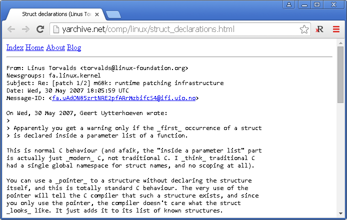

Reading Mode
============

Chrome extension that makes the [internet fast again](http://idlewords.com/talks/website_obesity.htm). Defaults to canceling all requests other than the main_frame: no JavaScript, no images, no XHR, no ads (not even an empty HTTP request to let them count eyeballs). No more loading 3MB websites to read <500 words. Everything reads like Linux kernel documentation.

Recommended for use with user-specified custom stylesheets. Probably best to modify the rules to match your own browsing habits (e.g., reading mode disabled for Gmail, etc.).

Install
-------
Download  and drop it into Chrome.

Modify
------
Download [source files as zip](https://github.com/srpeck/readingmode/zipball/master), go to , enable Developer mode, and Load unpacked extension.
